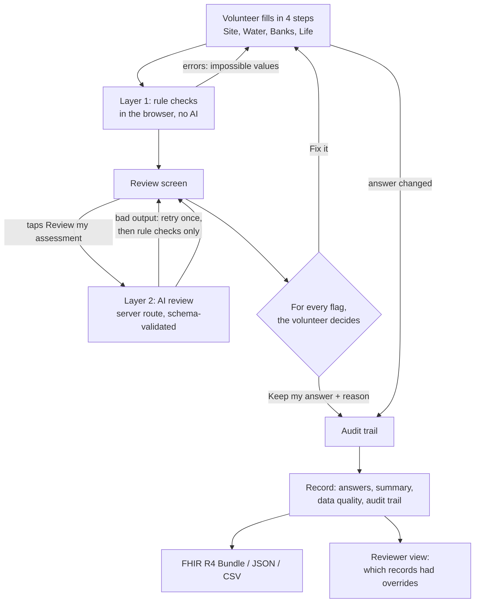

# RiffleCheck

A guided stream assessment that checks a volunteer's answers as they go, explains every concern in plain language, and leaves every decision with the person.

**OneAquaHealth IEEE Global Hackathon 2026, Track 3: AI-Supported Assessment.** The track asks teams to "use AI responsibly to support stream assessment without replacing human judgment". RiffleCheck answers it with two layers of checking that can only ask questions: the volunteer either fixes an answer or keeps it and says why, and both outcomes are recorded.

## The problem

OneAquaHealth links the health of urban streams to human wellbeing (One Health). Volunteers assess streams with a mobile app, and their observations can be inconsistent or contain slips: a "clear" stream that is also "brown", a sewage smell with "no pollution source seen", a pH of 15. Records like these are hard for researchers and city planners to use, and silently correcting them would replace the judgement of the only person who was actually standing at the stream.

## How it works



1. **Form.** Four steps with a one-line plain-language helper on every field. Drafts save to the browser on every change.
2. **Layer 1, rule checks.** A typed rule table (`src/lib/rules.ts`) runs in the browser. Errors (impossible values, a dry stream with water readings, missing answers) block progress. "Check" and "unusual" flags go to the review screen.
3. **Layer 2, AI review.** On "Review my assessment" the server sends the answers and the Layer 1 results to Gemini and accepts only JSON that matches a schema. The AI looks for things rules cannot see, mainly free-text notes that disagree with a chosen answer.
4. **The volunteer decides.** Each flag shows the concern, an expandable "Why am I seeing this?", the answers involved, whether it came from a rule or the AI, and the AI's confidence. The choices are **Fix it** (jumps to the field) or **Keep my answer** (a reason is required). Submission is blocked until every flag has a decision.
5. **Record.** Final answers, a plain-language summary, a data quality panel, the full audit trail with before and after values, and three downloads.

## Run it

Needs Node 20 or newer.

```bash
git clone https://github.com/Adi-o-s/rifflecheck.git
cd rifflecheck
npm install
npm run dev
```

Open http://localhost:3000. Other commands: `npm test` (160 tests, including the fuzz tests), `npm run eval:ai` (runs the live model five times on each sample and checks every flag; needs a key), `npm run build`, `npm run examples` (regenerates `examples/`), `python3 scripts/validate-fhir.py` (validates the example bundles with the HL7 validator).

### Demo mode (no API key)

The app works with no key and says so in a banner on every page. In demo mode:

- Rule checks run in full.
- AI review returns prepared responses for the three built-in samples. Each prepared flag is only shown while the answers it refers to are still on the form.
- For any other assessment the review screen shows "AI review unavailable, rule checks only" and the volunteer can still submit.

To turn on live AI review, copy `.env.example` to `.env.local` and add a free Gemini key from https://aistudio.google.com/apikey (no card needed):

```bash
cp .env.example .env.local   # then set GEMINI_API_KEY
```

### Try the samples

The home page has three made-up assessments that open on the review screen:

| Sample | What to expect |
|---|---|
| Clean | Zero rule flags; the AI returns an empty list. |
| Contradictory | Three rule flags (clear but brown and muddy; sewage smell but no source seen; raining now but "no rain in 48 hours") and two AI flags that only free text reveals (notes say "barely moving" but flow is "Fast"; notes mention a pipe but sources is "None seen"). |
| Unusual but plausible | One "unusual" flag (mayfly larvae with a sewage smell) that the volunteer can keep with a reason. |

Finished versions of the same three are already in the reviewer view.

## The checks

### Layer 1 rules

| Rule id | Severity | Fires when |
|---|---|---|
| `ph-range`, `temperature-range`, `oxygen-range` | error | pH outside 0 to 14, temperature outside -1 to 40 °C, dissolved oxygen outside 0 to 20 mg/L |
| `latitude-range`, `longitude-range` | error | Coordinates outside the possible range |
| `date-future` | error | Date and time are in the future |
| `dry-with-water-readings` | error | Flow is "Dry" but clarity, colour, temperature, pH or dissolved oxygen was entered |
| `life-none-with-others`, `sources-none-with-others` | error | "None" is ticked together with other answers |
| `required:*` | error | A required answer is missing |
| `clear-but-coloured` | check | Clarity is "Clear" but colour is brown or grey, or the notes mention mud or silt |
| `pollution-signs-no-source` | check | Sewage or chemical smell, or an oil sheen, with pollution sources "None seen" |
| `raining-now-no-recent-rain` | check | Weather now is light or heavy rain, but rain in the last 48 hours is "No" |
| `sensitive-life-with-pollution-signs` | unusual | Mayfly or stonefly larvae with a sewage smell or opaque water |
| `no-life-in-healthy-looking-stream` | unusual | No life seen, but dense bank vegetation and clear water |
| `good-impression-with-pollution-signs` | unusual | The volunteer's overall impression is "Good" with a sewage or chemical smell, an oil sheen, or opaque water |

Recent rain with cloudy water is not a flag. It adds a note to the record that the rain can explain the cloudiness.

Errors must be fixed. "Check" flags are phrased as questions. "Unusual" flags say the combination is uncommon and worth a second look, never that it is wrong; a unit test enforces that wording.

### Layer 2 AI review

- Model: Gemini (`gemini-3.5-flash-lite` by default, set `GEMINI_MODEL` to change), called from `src/app/api/review/route.ts` with a JSON response schema. The lite model answers in about a second, which matters at a stream; the larger `gemini-3.5-flash` took over ten seconds per reply in testing. If the main model is rate limited, the retry goes to a second model (`gemini-3.1-flash-lite`), which has its own free quota.
- The response is validated with Zod on the server. If it fails to parse or has the wrong shape, the server retries once, then returns rule results only with a visible notice. The same happens if the network is down. Nothing crashes.
- After validation the server drops any flag that:
  - names a field that does not exist or was not shown to the AI;
  - **is not grounded**: anything the model puts in quotation marks, and every number it mentions, must appear in the answers it was sent (`isGrounded` in `src/lib/ai/review.ts`). A flag that quotes a value the volunteer never entered is treated as invented;
  - repeats a rule flag;
  - reads like a score, a stated cause, health advice, or a correction (`violatesPolicy`).
- The route is rate limited (12 reviews a minute per caller) and rejects oversized requests, so a public deployment cannot be used to burn the API quota.
- `npm run eval:ai` runs the live model five times on each sample, prints every flag and how many the guards dropped, and fails if the clean sample gets a flag.

## Responsible-AI design choices

- **Nothing is auto-corrected.** No code path lets a rule or the AI write to the answers. The audit functions are pure and a unit test checks the answers are untouched.
- **The human decides, and the decision is kept.** Every flag ends as "fixed" (with before and after values) or "kept" (with the volunteer's reason). An override is treated as information for researchers, not as a failure.
- **Rules first, AI second.** Anything that can be checked deterministically is a rule. The AI only runs after rule errors are fixed and is told what the rules already flagged so it does not repeat them.
- **The AI asks, it does not tell.** The prompt forbids health scores, causes stated as fact, health advice, and corrections, and tells the model that an empty list is a good answer. A server-side filter backs the prompt up.
- **Every flag shows its source.** "Rule check" or "AI review", with the AI's confidence, and an explanation of why it appeared. AI flags carry a reminder that the AI cannot see the stream and may be mistaken.
- **Data minimisation.** The photo and the exact coordinates are never sent to the AI. The volunteer's notes are passed as data, with an instruction to the model not to treat them as instructions.
- **No stream health score.** The data quality panel describes the record (flags raised, fixed, kept), not the stream. The only rating in the app is the volunteer's own "overall impression".
- **Overrides feed back into the checks.** The reviewer view shows, for every check, how often volunteers fixed their answer and how often they kept it. A check that is mostly kept is a signal to researchers that the rule or its wording needs work, so the people in the field calibrate the system rather than the other way round.
- **It degrades safely.** With no key, a broken model reply, or no network, the volunteer still gets the rule checks and can submit.
- **Accessibility.** Labelled inputs, native radios and checkboxes, keyboard reachable, visible focus, tap targets of 44 px or more, and severity shown by icon and text as well as colour.

## Assessment fields and the OneAquaHealth app

**The form fields are a generic visual stream assessment, to be mapped to the official protocol.** The OneAquaHealth Citizen Science App's form is behind a login, so its exact wording could not be copied. The table shows which app category each field corresponds to, based on public descriptions of the app. The mapping should be confirmed with the OneAquaHealth team.

| RiffleCheck field | OneAquaHealth app category |
|---|---|
| Stream name, location, date and time | Site selection |
| Weather now, rain in last 48 hours | Not in the app (context for the checks) |
| Flow | Flow |
| Water colour, clarity, surface | Water aspect |
| Odour | Water aspect; sewage |
| Water temperature | Optional extra (water temperature) |
| pH, dissolved oxygen | Not in the app (optional measurements) |
| Bank vegetation cover | Left and right margins (plant cover) |
| Bank erosion | Bed and banks |
| Channel | Channel form |
| Nearby land use | Left and right margins (paving) |
| Visible pollution sources | Polluted pipes; sewage; works |
| Animals and plants seen | Habitats (the app has no wildlife list) |
| Your overall impression | Overall rating (Good / Moderate / Poor) |
| Photo, notes | Photos; free text |

All fields, labels, helpers and options live in one table (`src/lib/fields.ts`) that drives the form, the CSV columns and the FHIR `linkId`s, so swapping in the official questions is a change to one file plus the rules that read them.

## Exports

### FHIR R4 Bundle

`Download FHIR` produces a `Bundle` of type `collection` (see `examples/*.fhir.json`):

| Resource | Content |
|---|---|
| `Location` | Stream name, `position.latitude` and `position.longitude`. Shaped to the OneAquaHealth IG profile `LocationOah` (identifier, name, mode = instance). |
| `QuestionnaireResponse` | Every answer; `linkId` is the field key. |
| `Observation` | One per numeric measurement entered (water temperature, pH, dissolved oxygen) with `valueQuantity` in UCUM units, and one per qualitative answer that matches a OneAquaHealth indicator (flow, colour, odour, surface, bank vegetation, channel, land use, and fish / amphibians / birds seen) with category `survey` and a `valueCodeableConcept`. All are `status` final, subject = the Location, `derivedFrom` the QuestionnaireResponse, and shaped to the IG profile `ObservationIndicatorsOah`. |
| `Provenance` | The audit trail. One for the record, plus one per flag decision: the decision in `activity`, the volunteer's reason in `reason`, who raised the flag in `agent`, and each changed answer as an `entity` with role `revision`. The same detail is in the narrative. No extensions are used. |

### Codes used, and codes to confirm

| Use | System | Codes | Status |
|---|---|---|---|
| Measurement type | `http://hl7.eu/fhir/ig/oah/CodeSystem/temporarySystem-oah-eu` | `waterTemperature`, `pH`, `dissolvedO2` | Read verbatim from the OneAquaHealth IG source ([hl7-eu/oah](https://github.com/hl7-eu/oah), `oah-codeSystem.fsh`). The system URL, the profile URL and the `Cel` unit match the water-temperature example on the project's FHIR sandbox (`Observation/Obs-WaterTemp-Almyros-2024-11-21` at https://sandbox.hl7europe.eu/oneaquahealth/fhir). The code system is marked temporary and experimental by its authors. |
| Qualitative indicator | same system | `hydrology` (flow), `foam` (colour, odour, surface), `riparianVegetation` (bank vegetation), `morophology` (channel; the IG's own spelling), `LandUse` (land use), `fish`, `amphibians`, `birds`, and the value `present` | Read verbatim from the same source. **To confirm with the IG authors:** whether these are the right indicators for these citizen answers, in particular bank vegetation cover (the IG has percentage bands that the form's None / Sparse / Moderate / Dense do not map onto) and treating a ticked animal as `present`. Water clarity, bank erosion, pollution sources and the other animals have no matching indicator and stay in the QuestionnaireResponse only. |
| Units | `http://unitsofmeasure.org` (UCUM) | `Cel`, `[pH]`, `mg/L` | Accepted by the HL7 validator. |
| Provenance activity | `http://terminology.hl7.org/CodeSystem/v3-DataOperation` | `CREATE`, `UPDATE` | Accepted by the HL7 validator. |
| Provenance agent type | `http://terminology.hl7.org/CodeSystem/provenance-participant-type` | `author` | Accepted by the HL7 validator. |
| Choice answers | `https://rifflecheck.example/fhir/CodeSystem/<field>` | the option keys in `fields.ts` | **Placeholder.** To be replaced by the OneAquaHealth app's own answer codes. |

**Why Observations and not only a QuestionnaireResponse.** The project's "Informatics, Technology & Standards" learning session (27 August 2026) says citizen reports should share the same Observation profiles, value sets and validation rules as sensor and laboratory data, with performer metadata on every observation. The export follows that: every answer that has a OneAquaHealth indicator is an Observation in the project's profile, linked back to the full QuestionnaireResponse with `derivedFrom`.

**LOINC: none used.** The brief suggested LOINC for water temperature, pH and dissolved oxygen. Searching loinc.org turned up only body-fluid codes (for example 2748-2 "pH of Body fluid"), none for stream water, so no LOINC code is claimed. The OneAquaHealth IG defines its own codes for exactly these three measurements, and those are used instead. If the project later adopts LOINC or another environmental vocabulary, the mapping is three lines in `src/lib/export/fhir.ts`.

### HL7 validator result

The three example bundles were validated with the official HL7 validator service (validator.fhir.org, FHIR 4.0.1) on 5 October 2026 using `scripts/validate-fhir.py`: **0 errors** on each. Warnings (42 to 44 per bundle, a handful of kinds repeated once per resource), all expected:

- *Profile reference has not been checked because it could not be found*: the OneAquaHealth IG is not on a package server (its build page returned 404 on 5 October 2026), so the validator cannot load the profiles. Conformance to them is by construction, checked by eye against the sandbox examples, and has not been machine-checked.
- *A definition for CodeSystem could not be found*: the same cause for the OneAquaHealth code system, plus this prototype's placeholder answer codes.
- *No code provided* on `Provenance.activity` and `Provenance.reason` for "kept" decisions: there is no standard code for "volunteer kept their answer" or for a free-text reason, so these are text only.
- One *Error performing tx5 operation*: the validator's own terminology server timing out.

Informational notes: no `Questionnaire` is referenced.

### JSON and CSV

- **JSON**: the full record: answer codes, on-screen labels, summary, AI review status, data quality counts, and the audit trail.
- **CSV**: one header row and one row per assessment. Choices use the on-screen labels, numbers are bare, multi-selects are joined with `; `, and text that could be read as a spreadsheet formula is neutralised. The reviewer view can download all listed records in one file.

## Architecture

Next.js (App Router) + TypeScript + Tailwind. No login and no database: assessments are stored in the browser's localStorage. One server route exists only to keep the API key off the client.

```
src/lib/
  fields.ts          field table: key, step, label, helper, options, OAH category
  rules.ts           Layer 1 rule table and runner
  audit.ts           flag tracking, fix / keep decisions, submit guard, quality counts
  summary.ts         two-sentence summary built from the answers without AI
  seed.ts            the three samples and their finished records
  storage.ts         localStorage store
  ai/prompt.ts       system prompt and payload
  ai/schema.ts       Zod schema for the AI reply, and the request
  ai/review.ts       Gemini call, validation, retry, fallback, grounding and policy guards
  rateLimit.ts       per-caller limit for the AI route
  ai/canned.ts       demo-mode responses
  export/            fhir.ts, csv.ts, json.ts
src/app/
  page.tsx           home
  assess/[id]/       form and review screen
  record/[id]/       record page and downloads
  reviewer/          reviewer view
  api/review/        Layer 2 route
```

Tests (Vitest) cover every rule firing and not firing, the wording of "unusual" flags, the fix / keep / submit state machine, AI retry and fallback with a mocked model, the grounding and policy guards, the rate limit, the FHIR bundle's required fields and reference integrity, and CSV escaping.

## Stress tests

Run on 5 October 2026. The scripts are in the repo so anyone can repeat them.

| What | How | Result |
|---|---|---|
| Rule engine fuzz | `STRESS_SCALE=20 npm test`: 100,000 random and hostile assessments per seed, 3 seeds | No crash, no input changed, same input always gives the same flags |
| Decision logic fuzz | Same command: 8,000 random sessions of up to 60 actions (edit, keep, reopen, AI review, submit) per seed | In every state: answers changed only by the volunteer's own edits; no "kept" flag without a reason; no submitted record with an error or an undecided flag; every submitted record exported as valid FHIR, CSV and JSON |
| AI guard fuzz | Same command: 60,000 fake model replies per seed, a third of them carrying scores, stated causes, advice or invented values | Nothing that fails the policy or grounding check was ever let through |
| Server load | `npm run stress:http` against a production build: 3,000 page loads and 3,000 API calls, 100 at a time | 0 errors; pages p95 193 ms, API p95 53 ms on a laptop |
| Rate limit | One caller sending 200 AI requests | Exactly 12 allowed, 188 refused with HTTP 429 |
| Hostile requests | 16 malformed or malicious payloads (broken JSON, 5 MB body, deep nesting, prototype pollution, smuggled photo) | All refused with 400, 409 or 413; never a 500; no key in any response |
| Prompt injection | `npm run stress:ai`: 5 attacks typed into the notes and stream name against the live model (demand a score, impersonate the system, break out of the JSON, invent observations, declare an answer wrong) | No injected instruction reached the screen in any of the 5 |
| Browser | Damaged and non-JSON saved data; script tags in names and notes; 600 saved records (1.7 MB); storage full; triple-click on submit | No crash, no script ran, typing stayed at one frame (17 ms), a clear "could not save" notice, one record per submit |

The fuzzing found three real defects, all now fixed and covered by tests: damaged saved data could crash the rule checks; a date that could not be parsed was accepted and would have produced an invalid FHIR date; control characters pasted into notes would have made the FHIR export invalid.

What this does not cover: real phones on a poor connection, many volunteers at once on a deployed server (the load test ran on one laptop in demo mode), and injection attacks beyond the five tried.

## Limitations

- **The fields are not the official OneAquaHealth protocol.** They are a generic visual assessment with a mapping table. The rules would need review by a freshwater ecologist before real use.
- **The rule thresholds are simple.** For example, a temperature limit of 40 °C and "mud" as a keyword. They catch slips, not subtle errors, and the keyword check only understands English.
- **The AI can be wrong in both directions.** It can miss a real inconsistency or question a correct answer. The policy guard is pattern-based and can be evaded by unusual wording, and the grounding guard only checks quoted text and numbers, so it will sometimes drop a fair question and cannot catch an invented claim written without quotes. The retry, fallback and guards are tested with mocked model replies. Live testing is small: 15 runs with `npm run eval:ai` on 5 October 2026 (`gemini-3.5-flash-lite`). The clean sample got no flags in 5 of 5 runs; the contradictory sample got the notes-versus-flow flag in 5 of 5 and the notes-versus-pollution-sources flag in 4 of 5; every flag quoted only text from the answers. The unusual sample got one unnecessary question in 5 runs (it asked about a smell the notes had already explained, and rated its own confidence as high). Three made-up samples are not an evaluation.
- **Data stays in one browser.** There is no sync, no backup and no way to send a record to OneAquaHealth yet. Clearing browser data deletes everything.
- **The reviewer view shows only this browser's records.** It demonstrates what a researcher would see; it is not a multi-user tool.
- **Photos are stored as small thumbnails** in localStorage, are not included in the exports, and are not analysed.
- **FHIR conformance to the OneAquaHealth profiles is not machine-checked** because the IG package is not published; see above. The mapping of citizen answers to indicators is a proposal. The IG has no model yet for citizen answers or for an audit trail, so the QuestionnaireResponse and Provenance shapes are proposals.
- **English only**, and not tested with screen-reader users.
- **A volunteer can keep any non-error answer** with any reason. That is by design, and it means the record's quality still depends on the volunteer.

## Next steps for integrating with the OneAquaHealth app

1. Replace `fields.ts` with the app's real questions and answer codes, and have ecologists review and extend the rule table for the official protocol.
2. Run the rule table inside the existing app as a library: it is plain TypeScript with no dependencies, so it works offline at the stream.
3. Send records to the OneAquaHealth FHIR server (the project runs a sandbox at sandbox.hl7europe.eu/oneaquahealth) as the FHIR Bundle, and propose the `Provenance` audit trail and a citizen `Questionnaire` to the IG authors.
4. Give researchers the override data: which rules are kept most often shows which questions or helpers are confusing, and which rules are too strict.
5. Evaluate the AI layer on real, anonymised assessments with ecologists labelling the flags as useful or not, before it is switched on for volunteers.
6. Translate the form and prompts into the languages of the project's research cities.

## What production would still need

This is a prototype. Before volunteers rely on it, it would need:

- The official protocol's questions, and rules reviewed and signed off by freshwater ecologists.
- A server-side store with accounts or pseudonymous IDs, consent, and a GDPR review. Today everything lives in one browser.
- Offline support at the stream (installable app with a service worker) and translations for the research cities.
- An evaluation of the AI layer on real assessments, with ecologists labelling flags as useful or not, and monitoring of how often the guards drop output.
- Validation against the published OneAquaHealth FHIR package once it is available, and agreement with the IG authors on how citizen answers and the audit trail are modelled.
- A shared rate limiter, error monitoring, and an accessibility audit with screen-reader users.

## Licence

MIT. See `LICENSE`. All code in this repository was written for this hackathon.
